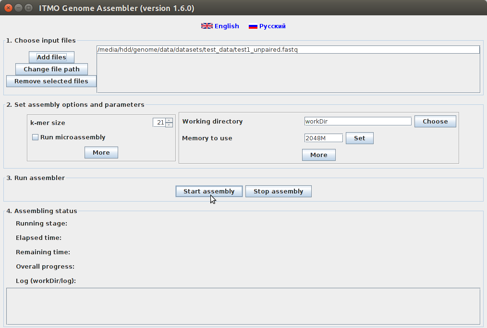
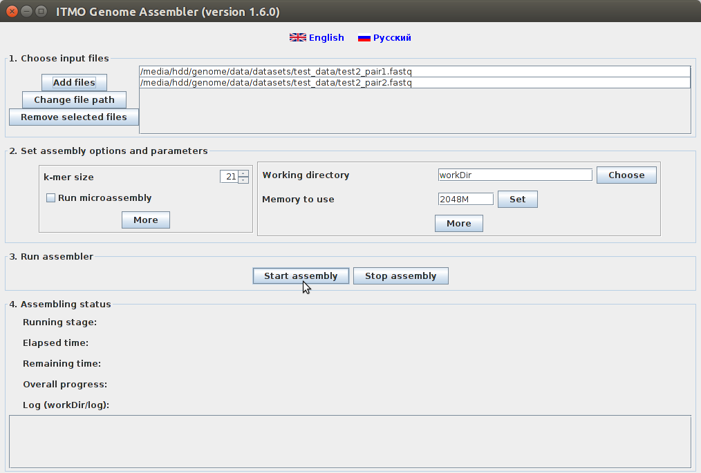

**ITMO *de novo* Genome Assembler** is a software for assembling small and middle-sized genomes with ease. <br/>
It had been developed by the team of researchers from Genome Assembly Algorithms Laboratory (now — bioinformatics group in [Computer Technologies Laboratory](http://ctlab.ifmo.ru/)) at ITMO University with the participation of the "Bioengineering" center of Russian Academy of Sciences. 

Active development of the software had been conducted from 2010 to 2016. Currently the main functionality of the assembler is supported, but without further improvements.


Supported sequencing technologies - *Illumina*/*Solexa*, *Ion Torrent* (with indel errors) and *Sanger*.<br/>
Assembler can use both paired reads (paired-end, mate-pair) as well as unpaired ones.<br/>
The assembly can be started both from command line as well as from simple and clear graphical user interface:<br/>
<a href="GUI-0.1.3.png"></a>


## First run

To run the assembler *JRE* 1.6 or higher is required (you can download it <a href="http://www.oracle.com/technetwork/java/javase/downloads/index.html">here</a>).<br/>
No other packages are required, you only need to download one running script.


You can download it from the last stable release in the GitHub ['Releases' page](https://github.com/ctlab/metafast/releases).<br/>
Download:
* `itmo-assembler.sh` — for Unix-like OS (tested on Ubuntu, Debian and Mac OS). After downloading add a permission to run the script via command `chmod +x itmo-assembler.sh` and run it via `./itmo-assembler.sh`.
* `itmo-assembler.bat` — for Windows OS (tested on Windows 7); 
* `itmo-assembler.jar` — for other platforms.


After running this command the graphical user interface will arise.<br/>
If you want to work with the assembler from the command line, add `-h` option to the command and the assembler prints the instruction how to start the assembly.

Before starting the assembly please make sure that there is enough free space on your hard drive. The assembler makes temporary files in working directory in order to be able to continue run from any stage.


## Examples

**Example 1.** Download [test1_unpaired.fastq](https://github.com/ctlab/itmo-assembler/raw/master/test_data/test1_unpaired.fastq) from `test_data` directory.<br/>
Start the assembly via command
~~~
itmo-assembler.sh -i test1_unpaired.fastq
~~~
or using graphical user interface:<br/>
<a href="GUI-unpaired.png"></a>


After the assembly will finish, assembled contigs' statistics will be printed:<br/>
```
Statistics:
Total contigs: 1
Contigs>=500bp: 1
Total length: 641'766
Maximal length: 641'766
Mean length: 641'766
Minimal length: 641'766
N50: 641'766
N90: 641'766
```
Assembled contigs will be placed in `workDir/contigs.fasta`. `workDir` directory is created in the directory, from which the assembler was started.<br/><br/>


**Example 2.** Download files with paired reads (left and right reads) -- [test2_pair1.fastq](https://github.com/ctlab/itmo-assembler/raw/master/test_data/test2_pair1.fastq) and [test2_pair2.fastq](https://github.com/ctlab/itmo-assembler/raw/master/test_data/test2_pair2.fastq).<br/>
Start the assembly via command
~~~
itmo-assembler.sh -i test2_pair1.fastq test2_pair2.fastq
~~~
or using graphical user interface:<br/>
<a href="GUI-paired.png"></a>

After the assembly will finish, assembled contigs' statistics will be printed:<br/>
```
Statistics:
Total contigs: 61
Contigs>=500bp: 61
Total length: 649'946
Maximal length: 49'875
Mean length: 10'655
Minimal length: 529
N50: 21'925
N90: 8'213
```
<br/>

---

The assembler is freely distributed under the MIT License. 

Previous versions of the assembler can be found at [genome.ifmo.ru/files/software/assembler](http://genome.ifmo.ru/files/software/assembler).

### Publications:

1. Alexandrov A., Kazakov S., Melnikov S., Sergushichev A., Shalyto A., Tsarev F. Combining de Bruijn graph, overlap graph and microassembly for de novo genome assembly / In Proceedings of "Bioinformatics 2012". Stockholm, Sweden. 2012. p. 72. [[Abstract pdf](http://rain.ifmo.ru/~svkazakov/papers/alexandrov-bioinf-2012-abstract.pdf)] [[Poster pdf](http://rain.ifmo.ru/~svkazakov/papers/alexandrov-bioinf-2012-poster.pdf)]
2. **[Russian]** Сергушичев А., Александров А., Казаков С., Царев Ф., Шалыто А. Совместное применение графа де Брёйна, графа перекрытий и микросборки для de novo сборки генома // Известия Саратовского университета. Новая серия. Серия Математика. Механика. Информатика. 2013. Т. 13, вып. 2, ч. 2, с. 51–57. [[pdf](http://rain.ifmo.ru/~svkazakov/papers/sergushichev-isu-2013.pdf)]
3. **[Russian]** Александров А., Казаков С., Мельников С., Сергушичев А., Царев Ф. Метод сборки контигов геномных последовательностей на основе совместного применения графов де Брюина и графов перекрытий // Научно-технический вестник информационных технологий, механики и оптики. 2012. № 6 (82), с. 93-98. [[pdf](http://rain.ifmo.ru/~svkazakov/papers/alexandrov-vestnik-itmo-2012.pdf)]
4. **[Russian]** Александров А., Казаков С., Мельников С., Сергушичев А., Царев Ф., Шалыто А. Метод исправления ошибок в наборе чтений нуклеотидной последовательности // Научно-технический вестник Санкт-Петербургского государственного университета информационных технологий, механики и оптики. 2011. № 5 (75), с. 81-84. [[pdf](http://rain.ifmo.ru/~svkazakov/papers/alexandrov-vestnik-itmo-2011-5.pdf)]
<br/><br/>


Based on the assembler code, several tools have been developed -- such as [MetaFast](http://dx.doi.org/10.1093/bioinformatics/btw312) and [MetaCherchant](https://doi.org/10.1093/bioinformatics/btx681).


## Contact

For any questions please write us to genome@mail.ifmo.ru.

